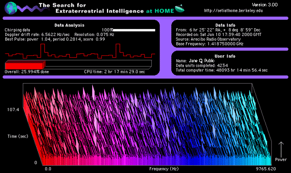

:title: Open Sourcing Science
:author: Amy Boyle
:description: Open source tools for Scientific Research
:css: foss_science.css

.. :data-transition-duration: 500

---------------------------------------------------------------

:id: who-am-i

:data-scale: 1

Open Sourcing Science
===================================

Open source tools for Scientific Research
******************************************

Amy Boyle
`@amylouboyle`__

.. note::
    I am going to talk making science research more open source. Both from the angle of using existing open source tools, and making your own code open source.

__ https://twitter.com/amylouboyle

----------------------------------------------------------------

:data-x: r500
:data-y: r1200
:data-z: r-500

.. note::

    * Worked in a neuroscience research lab 
    * We study basic auditory neuroscience using electrophysiology
    
----------------------------------------------------------------

How do I Science?
==================

* Reproducibility in Science
* Using OS in practice
* Citizen Science

----------------------------------------------------------------

Open science vs open source
===========================

* Open science is the idea that scientific research should be open and immediately shared
* Open source is the practice of open and universal access to the source code of software

----------------------------------------------------------------

:id: old-days

Back in the old days...
=======================

.. note::
    * Back in the days when people had to correspond by postal mail and telephone...
    * Only way to get more information on a project was to contact the paper author directly
    * If they have time, they respond

----------------------------------------------------------------

:id: cover-zoom

:data-scale: 0.4
:data-x: r0
:data-z: r0
:data-y: r200

.. image:: img/paper_cover.jpg
    :width: 50%

----------------------------------------------------------------

:id: paper-inside

:data-y: r0
:data-rotate-y: 90

.. image:: img/paper_inside_highlight.jpg
    :width: 50%

"Stimulus generation was controlled by custom-written software on a personal computer..."

"... as measured by custom-designed software performing a fast Fourier transform of the digitized microphone signal."

----------------------------------------------------------------

:data-scale: 1
:data-rotate-y: 0
:data-x: r500
:data-y: r1200
:data-z: r-500

The internet!
==============

.. image:: img/puppy_dash.png
    :width: 300px

.. note::
    With it ushered in a new age of easy widespread sharing of tools and collaboration! Reproducibility abounds!

    image: http://allycatblu.deviantart.com/art/Puppy-Twilight-Sparkle-And-Rainbow-Dash-426306666

----------------------------------------------------------------

Change is hard.

.. image:: img/sad_puppy.jpg
    :width: 500px

.. note::

    Except that didn't happen. Not quite. Change is hard. Still, often the only way to get data or associated code is to contact a paper author directly, and ask for it.

    Difference is you can email someone instead of write them
    * still need to hope they respond in a timely manner
    * they still have what you want

    image: http://www.reddit.com/r/aww/comments/27t8mk/i_took_my_new_german_shepherd_puppy_to_the_beach/

----------------------------------------------------------------

Why ?
=====

Science has a reproducibility problem

.. note::
    * Its a matter of incentives
    * Scientists are typically evaluated based on the number of papers they have published/ quality of the journals 
    * Not on whether their findings can be reproduced. 

    There is little perceived incentive to spend much of your valuable time on reproducibility.

    A 2012 study found that only 25% of the papers they reviewed were reproducible. Another found 10%.

    extra:

    Reproducibility project: conducting a study to investigate the replicability of cancer biology studies. The top 50 most impactful cancer biology studies published between 2010-2012 are being replicated by the Science Exchange network.

    Reproducibility Initiative: http://blogs.plos.org/everyone/2012/08/14/plos-one-launches-reproducibility-initiative/

----------------------------------------------------------------

I care cuz why?
===============

.. note::

    Everyone:

    * Scientific process is ultimately self-correcting,
    * With enough testing, incorrect data will eventually be discovered and disregarded
    * we have a responsibility to one another and society (taxpayers) to increase this process’s efficiency

    Scientists:

    [Sharing Detailed Research Data Is Associated with Increased Citation Rate](http://journals.plos.org/plosone/article?id=10.1371/journal.pone.0000308)

    Duplication of effort

    image : http://www.reddit.com/r/aww/comments/2sbxhe/my_german_shepherd_pup_gets_a_little_confused/

----------------------------------------------------------------

What we can do about it?
==========================

Docs, tests, version control, Access.

.. note::
    What practices can we promote to get to where we need to be?

    This talk is mostly concerned about the source code piece of the reproducibility puzzle. This means docs, tests, version control, and access to the code.

    Scientist coders are notorious for not including docs, tests, and version control with their code. These are the things that will make your code reusable to future you and others.

----------------------------------------------------------------

:id: hard-way

Learning the Hard Way
=====================

.. image:: img/puppy_cactus.jpg
    :width: 40%

.. note::
    image: http://fox8.com/2012/04/27/good-samaritan-rescues-puppy-from-cactus/

----------------------------------------------------------------

:data-scale: 0.4
:data-x: r250
:data-y: r0
:data-z: r-600
:data-rotate-y: 90

----------------------------------------------------------------

:data-scale: 0.4
:data-x: r-400
:data-z: r0
:data-rotate-y: -90

----------------------------------------------------------------

:data-scale: 1
:data-rotate-y: 0
:data-rotate-x: 0
:data-x: r500
:data-y: r1200
:data-z: r-500

Docs or it didn't happen.
==========================  

.. note::
    * No docs for batlab, only oral tradition. Don't even attempt to look at code.
    
    Instructions -- under version control
    Code docs

----------------------------------------------------------------

No tests?

.. note::
    image : http://giphy.com/gifs/spoilers  -neil-degrasse-tyson-cant-tell-yH44qh8DpNyfK

----------------------------------------------------------------

:data-rotate-y: 90
:data-x: r0
:data-y: r0
:data-z: r0

Testing
========

Just do it.

.. note::
    There are plenty of testing frameworks out there. There is one available for your language/framework.

    Test serve as a form of docs, and increase confidence, consistency

    Sparkle has tests. Catches a lot of bugs before they are released

----------------------------------------------------------------

:data-rotate-y: 0
:data-x: r500
:data-y: r1200
:data-z: r-500

Version Control All the Things
===============================

.. image:: img/octocat.png

.. note::
    Git, Github, Bitbucket, mercurial. You NEED to be using version control. Anytime you analyze data, you must have an identifiable version of code associated with that data. I mean version number/ commit id, not some copy of the code saved to some Post-docs laptop. If you publish based on code get a DOI for it.

    image : https://education.github.com/
    
----------------------------------------------------------------

:data-rotate-y: -90
:data-x: r0
:data-y: r0
:data-z: r0

.. image:: img/version_comic.gif
    :width: 50%

.. note::
    If this is all obvious to you, encourage others by using examples that are relevant to them.

----------------------------------------------------------------

:data-rotate-y: 0
:data-x: r500
:data-y: r1200
:data-z: r-500

Access
========

Use Github.

.. note::
    You don't HAVE to use Github, but use some easy-to-find public place to host your code.

    Solves the ...its around here somewhere, I think. problem.

----------------------------------------------------------------

Encourage Programming literacy
==============================

    * Python, R, Octave, Julia
    * Software Carpentry, Coursera

.. note::

    disclaimer: Huge Python fangirl. Use tools that are available to everyone. Open source ensures no hangups on licensing/ different purchased versions of platforms/toolboxes.

    It is less important what you do your work in, than if you provide docs, tests, and version control with it. That being said, using popular languages/frameworks will still give you wider reach.

    R compares to SAS, SPSS or Strata
    Julia is a new, fast and beautiful language -- still some bugs though
    
    Why we use Python...

----------------------------------------------------------------

:data-y: 0
:data-z: 0
:data-x: 4000

Doing Data Analysis
=====================

Python
    * Numpy
    * Scipy
    * Pandas
    * IPython notebook

.. note:: 
    I'm going to show some examples of to use some of these packages to create, readable, re-usable
    code to analyze and visualize data.

    There is a wikipedia list (https://en.wikipedia.org/wiki/List_of_statistical_packages)

----------------------------------------------------------------

:data-y: r1200
:data-z: r-500
:data-x: r500

----------------------------------------------------------------

Example data file:

.. code::

    0.05946
    0.05842,0.1589
    0.05632
    0.00316,0.04972
    0.0593
    0.06124,0.07648
    0.05784

    0.04674,0.0602,0.07572,0.12892,0.1964
    0.05548

----------------------------------------------------------------

Using pure Python:

.. code:: python

    spike_times = []
    with open('spike_times.csv', 'r') as df:
        reader = csv.reader(df)
        for row in reader:
            floatrow = [float(item) for item in row]
            spike_times.append(floatrow)

    all_spike_times = sum(spike_times, [])
    # number of spikes per time bin of 5ms
    bins = [int(x/0.01) for x in all_spike_times]
    bin_counts = [bins.count(i) for i in range(20)]
    bin_edges = [i*0.01 for i in range(20)]
    print bin_edges, '\n', bin_counts

.. code:: 

    [0.0, 0.02, 0.04, 0.06, 0.08, 0.1, 0.12, 0.14, 0.16, 0.18]
    [9, 8, 67, 23, 8, 5, 4, 7, 10, 5]

----------------------------------------------------------------

Using Pandas and Numpy:

.. code:: python

    import pandas as pd

    spike_table = pd.read_csv('spike_times.csv', sep=',' 
                              names=range(5))

    all_spikes = spike_table.values.flatten()
    all_spikes = all_spikes[~np.isnan(all_spikes)]

    bin_edges = [i*0.01 for i in range(20)] + [0.2]
    spike_bins = pd.cut(all_spikes,bin_edges,labels=False)
    bin_counts = np.bincount(spike_bins)
    print bin_edges, '\n', bin_counts

.. code:: 

    [0.0, 0.02, 0.04, 0.06, 0.08, 0.1, 0.12, 0.14, 0.16, 0.18, 0.2]
    [9, 8, 67, 23, 8, 5, 4, 7, 10, 5]

----------------------------------------------------------------

Using R:

.. code:: R

    data = read.table('spike_times.csv', sep=',', header=FALSE, 
                      col.names=1:5,fill=TRUE)
    
    all_spikes = unlist(data)
    all_spikes = all_spikes[!is.na(all_spikes)]

    results = hist(all_spikes, 20)
    print(results['counts'])
    print(results['breaks'])

----------------------------------------------------------------

----------------------------------------------------------------

Data Visualization
===================

Python

    * Matplotlib
    * Seaborne
    * Bokeh
    * pyqtgraph

R

----------------------------------------------------------------

:id: mpl-viz

Matplotlib

.. code:: python

    import matplotlib.pyplot as plt

    spike_times = []
    with open('spike_times.csv', 'r') as df:
        reader = csv.reader(df)
        for row in reader:
            floatrow = [float(item) for item in row]
            spike_times.append(floatrow)

    all_spike_times = sum(spike_times, [])

    n, bins, patches = plt.hist(all_spike_times, 20, range=(0,0.2))
    plt.xlabel("time (s)")
    plt.ylabel("no. spikes")
    plt.title("Cell Spike Timing");

.. image:: img/mpl_bar_chart.png
    :width: 30%

----------------------------------------------------------------

:id: seaborn-viz

Seaborn

.. code:: python

    import seaborn

.. image:: img/seaborn_bars.png
    :width: 50%

---------------------------------------------------------------

:id: pandas-viz

Pandas

.. code:: python

    spike_table = pd.read_csv('spike_times.csv', sep=',', names=range(5))

    spike_table.plot(kind='hist', bins=20,  range=(0,0.2));
    plt.xlabel("time (s)")
    plt.ylabel("no. spikes")
    plt.title("Cell Spike Timing");

---------------------------------------------------------------

:id: bokeh-viz

Bokeh

.. code:: python

    from bokeh.charts import Histogram, show, output_notebook
    output_notebook()

    spike_times = []
    with open('spike_times.csv', 'r') as df:
        reader = csv.reader(df)
        for row in reader:
            floatrow = [float(item) for item in row]
            spike_times.append(floatrow)

    all_spike_times = sum(spike_times, [])

    hm = Histogram(all_spike_times, bins=20, xlabel='time (s)', 
                   ylabel='no. spikes', title='Spike timing')
    show(hm)

----------------------------------------------------------------

pyqtgraph

.. image:: img/sparkle.gif
    :width: 90%

----------------------------------------------------------------

:id: r-viz

R

.. code:: R

    data = read.table('spike_times.csv', sep=',', header=FALSE, 
                      col.names=1:5,fill=TRUE)
    all_spikes = unlist(data)
    all_spikes = all_spikes[!is.na(all_spikes)]
    results = hist(all_spikes, 20)

.. note:: 
    ggplot2 is a plotting system for R, based on the grammar of graphics

----------------------------------------------------------------

Honorable Mention
==================

* Julia
* ggplot2   

----------------------------------------------------------------

Sharing Results
================

Figshare, Dryad, Dataverse

.. image :: img/figshare.png
    :width: 70%

.. note::
    * Post your data online when submitting to a journal, or earlier, if possible. 
    * Having a system of posting data online, gives a bonus to yourself later when looking up old data, it's not ...somewhere... maybe on Jim's laptop?

    Open-access journal PLOS ONE now has a policy requiring its authors to submit relevant data during the review process and recommending they do so by posting their datasets to online repositories like Dryad.

----------------------------------------------------------------

:data-y: 0
:data-z: 0
:data-x: 8000

Citizen Science
=================

.. note::
    Citizen science is scientific research conducted, in whole or in part, by amateur or nonprofessional scientists. 

    SETI@Home (1999)

    How can we involve volunteer citizens in traditional scientific research?

----------------------------------------------------------------

:data-y: r1200
:data-z: r-500
:data-x: r500

Zooniverse
==========

* Galaxy Zoo
* Snapshot Serengeti

.. image:: img/galazy_zoo_screenshot.jpg
    :width: 500px

.. note::
    https://www.zooniverse.org/

    Galaxy zoo (2007): 
    * > 50 peer-reviewed science papers from results
    * > 100,000 volunteers, millions of classifications

    Snapshot Serengeti (2010-2013):
    * 225 camera traps across 1,125 km2 in Serengeti National Park, Tanzania, 
    * to study how predators and their prey co-existed across a dynamic landscape.
    * > 1.2 million pictures
    * 28,000 users

----------------------------------------------------------------

Gamified!
=========

* foldit
* Fraxinus

.. note::
    Foldit:
    * Protein folding game
    * improves the pattern-folding algorithms by training

    Fraxinus:
    * Candy Crush Style game that researches genetic variants 
    * that can protect Europe's ash trees from a deadly fungal disease. 
    * Listing "Fraxinus players" as an author on paper, with player names in the supplemental material.

    http://www.theguardian.com/technology/2014/jan/25/online-gamers-solving-sciences-biggest-problems.

----------------------------------------------------------------

IRL
====

    * Public lab 

.. image:: img/public_lab_kite.jpg
    :width: 500px

.. note::
    Open source software and hardware kits to monitor air water and land (http://publiclab.org/)

    e.g. Deepwater Horizon (http://www.aljazeera.com/indepth/inpictures/2015/04/busting-corporate-polluters-diy-tools-150420132053871.html)

    In the hands of citizens, these tools are being used to gather a huge range of environmental data; anything from canopy loss in Peru to industrial pollution in Spain.

----------------------------------------------------------------

Let's make science puppies and rainbows
========================================

* Document your project
* Write tests
* Use version control
* Engage and leverage others

.. image:: img/puppy_dash.png
    :width: 200px

----------------------------------------------------------------

:data-rotate-y: -90
:data-x: r0
:data-y: r0
:data-z: r0

`presentation source`_ on Github

slides on `amyboyle.ninja`__

.. _presentation source: https://github.com/boylea/open_source_science

__ <http://amyboyle.ninja/open_source_science/#/who-am-i>

----------------------------------------------------------------

:id: overview
:data-x: 7000
:data-y: 5000
:data-scale: 15
:data-rotate-z: 0
:data-rotate-x: 0
:data-rotate-y: 0
:data-z: 0